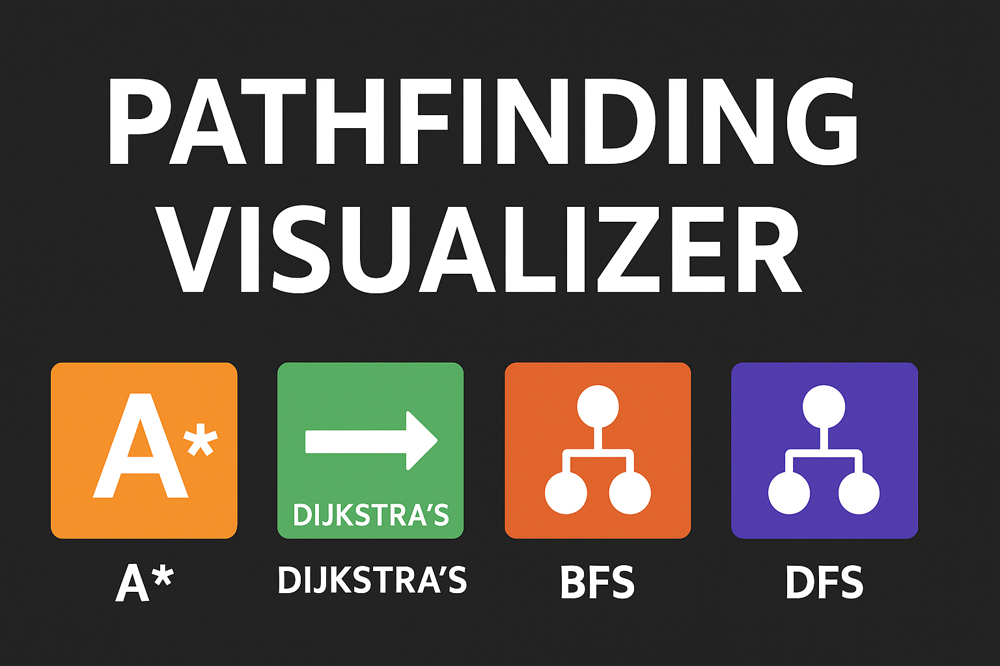

  

  
  
  
  

# 🧭 Pathfinding Visualizer

An interactive **Pathfinding Algorithm Visualizer** built in **Python (Pygame)** that helps visualize how different algorithms find the shortest path between two points — just like how **Google Maps** finds routes between locations.

---

## 🚀 Features

- 🎯 Visualizes multiple pathfinding algorithms:
  - **A\*** (A-Star) → Fastest and most accurate
  - **Dijkstra’s Algorithm**
  - **Breadth-First Search (BFS)**
  - **Depth-First Search (DFS)**
- 🧱 Create barriers and obstacles freely
- 🟩 Start and end node placement
- 🟨 Real-time animation of algorithm progress
- 🧹 Clear grid instantly
- 🖱️ Easy mouse interaction
- 🖥️ Responsive UI with legend box (works on laptops)

---

## 🧠 Algorithms Used

| Algorithm | Type | Optimal | Weighted | Notes |
|------------|-------|----------|-----------|--------|
| **A\*** | Heuristic | ✅ Yes | ✅ Yes | Combines Dijkstra + Greedy |
| **Dijkstra’s** | Weighted | ✅ Yes | ✅ Yes | Expands all nodes equally |
| **BFS** | Unweighted | ✅ Yes | ❌ No | Explores level by level |
| **DFS** | Unweighted | ❌ No | ❌ No | Goes deep before wide |

---

## 🎮 Controls

| Key / Action | Description |
|---------------|-------------|
| **Left Click** | Place Start, End, or Barriers |
| **Right Click** | Remove Node |
| **1** | Run **A\*** Algorithm |
| **2** | Run **Dijkstra’s** Algorithm |
| **3** | Run **BFS** Algorithm |
| **4** | Run **DFS** Algorithm |
| **SPACE** | Start Visualization |
| **C** | Clear Grid |
| **Exit Button** | Close Window |

---

## 🧰 Tech Stack

- **Language:** Python 3.12+
- **Library:** [Pygame](https://www.pygame.org/)
- **IDE:** VS Code

---

## 🔧 Future Improvements

- Add **Greedy Best-First Search**
- Add **Maze Generator**
- Implement **Dark Mode Theme**
- Adjustable **Grid Size**
- Step-by-step **Replay Mode**

---

## 🤝 Contributing

Pull requests are welcome!  
If you have ideas for new algorithms or UI improvements, feel free to **fork this repo** and submit a PR.

---

## 👨‍💻 Author

**Lal Singh**  
📧 [lalvariah@gmail.com](mailto:lalvariah@gmail.com)  
🌐 [GitHub – LsVaria](https://github.com/LsVaria)

---

## 🌟 Acknowledgements

Inspired by various visualizers built in **Python** and **JavaScript**  
Built with 💖 using **Pygame**  
Special thanks to the **open-source community** for their valuable learning resources.

---

## 🧾 License

This project is open-sourced under the **MIT License** — feel free to use, modify, and distribute it.
